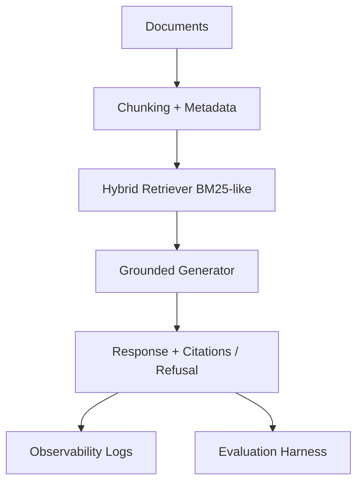

# Campus Policy Assistant (RAG)

A deployable, testable retrieval-augmented generation (RAG) starter for university-policy Q&A with grounded citations and safe refusal behavior.

## What this now includes (Phase 5)

- ✅ **Config-driven pipeline** (`app/config/settings.yaml`) for chunking, retrieval, generation, and evaluation thresholds.
- ✅ **Prompt versioning** in `prompts/` with answer/refusal prompt files.
- ✅ **Observability logging** (retrieved chunks, latency, scores, citation presence, refusal reasons).
- ✅ **Evaluation gate** that fails when quality drops below threshold.
- ✅ **CI workflow** running tests + evaluation on GitHub Actions.
- ✅ **Automated tests** for chunking, metadata extraction, retrieval shape, citation format, and refusal logic.

## Architecture (current)



## Quick start

```bash
python -m venv .venv
source .venv/bin/activate
pip install -r requirements.txt
pytest -q
python -m app.evaluation.evaluate
```

## Configuration

Central settings are in:

- `app/config/settings.yaml`

Key options include:

- `chunking.chunk_size`, `chunking.chunk_overlap`
- `retrieval.top_k`, `retrieval.min_score_to_answer`
- `generation.answer_model`, `generation.refusal_model`
- `evaluation.quality_threshold`

## Prompt versioning

Prompt artifacts:

- `prompts/answer_prompt_v1.txt`
- `prompts/answer_prompt_v2.txt`
- `prompts/refusal_prompt_v1.txt`

You can pin prompt versions in `settings.yaml`.

## Evaluation gate

Run:

```bash
python -m app.evaluation.evaluate
```

This returns a non-zero exit code when score < `evaluation.quality_threshold`, enabling CI failure on regressions.

## CI

GitHub Actions workflow:

- `.github/workflows/ci.yml`

Pipeline steps:
1. install dependencies
2. run `pytest -q`
3. run `python -m app.evaluation.evaluate`

## Tests

Current test coverage includes:

- chunk windowing and overlap behavior
- metadata extraction from markdown-like headings
- retrieval result shape and ranking sanity
- citation dictionary formatting
- refusal behavior when support score is weak
- evaluation pass/fail threshold behavior

## Next stretch goals (Phase 6)

Recommended order after this baseline remains stable:

1. multi-document comparison answers
2. conversational memory with grounded follow-up
3. failed-query admin dashboard
4. stale-source warning
5. OCR fallback for noisy PDFs
6. LangGraph stateful orchestration (`ingest -> retrieve -> rerank -> validate -> generate -> verify -> refuse/return`)

