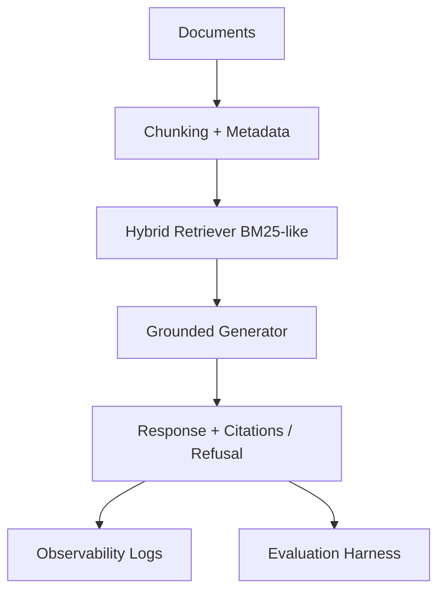

# Campus Policy Assistant (RAG)

A deployable, testable retrieval-augmented generation (RAG) starter for university-policy Q&A with grounded citations and safe refusal behavior.

## What this now includes (Phase 5)

- ✅ **Config-driven pipeline** (`app/config/settings.yaml`) for chunking, retrieval, generation, and evaluation thresholds.
- ✅ **Prompt versioning** in `prompts/` with answer/refusal prompt files.
- ✅ **Observability logging** (retrieved chunks, latency, scores, citation presence, refusal reasons).
- ✅ **Evaluation gate** that fails when quality drops below threshold.
- ✅ **CI workflow** running tests + evaluation on GitHub Actions.
- ✅ **Automated tests** for chunking, metadata extraction, retrieval shape, citation format, and refusal logic.

## Architecture (current)



## Quick start

```bash
python -m venv .venv
source .venv/bin/activate
pip install -r requirements.txt
pytest -q
python -m app.evaluation.evaluate
```

## Configuration

Central settings are in:

- `app/config/settings.yaml`

Key options include:

- `chunking.chunk_size`, `chunking.chunk_overlap`
- `retrieval.top_k`, `retrieval.min_score_to_answer`
- `generation.answer_model`, `generation.refusal_model`
- `evaluation.quality_threshold`

## Prompt versioning

Prompt artifacts:

- `prompts/answer_prompt_v1.txt`
- `prompts/answer_prompt_v2.txt`
- `prompts/refusal_prompt_v1.txt`

You can pin prompt versions in `settings.yaml`.

## Evaluation gate

Run:

```bash
python -m app.evaluation.evaluate
```

This returns a non-zero exit code when score < `evaluation.quality_threshold`, enabling CI failure on regressions.

## CI

GitHub Actions workflow:

- `.github/workflows/ci.yml`

Pipeline steps:
1. install dependencies
2. run `pytest -q`
3. run `python -m app.evaluation.evaluate`

## Tests

Current test coverage includes:

- chunk windowing and overlap behavior
- metadata extraction from markdown-like headings
- retrieval result shape and ranking sanity
- citation dictionary formatting
- refusal behavior when support score is weak
- evaluation pass/fail threshold behavior

## Next stretch goals (Phase 6)

Recommended order after this baseline remains stable:

1. multi-document comparison answers
2. conversational memory with grounded follow-up
3. failed-query admin dashboard
4. stale-source warning
5. OCR fallback for noisy PDFs
6. LangGraph stateful orchestration (`ingest -> retrieve -> rerank -> validate -> generate -> verify -> refuse/return`)

## Phase status
- ✅ **Phase 0 complete**: project framing, domain selection, corpus definition, user stories, success criteria, architecture, and repo structure.
- ✅ **Phase 2 complete**: hybrid dense+keyword retrieval, reranking, metadata filtering, chunking experiments, and query rewriting.
- ✅ **Phase 3 complete**: citation-enforced generation, unsupported refusal logic, citation validation, and confidence gating.
- ✅ **Phase 4 scaffold complete**: golden dataset, evaluation runner, experiment logging, and regression report outputs.

## Retrieval upgrades (Phase 2)
- **Hybrid retrieval**: combines dense Chroma similarity and sparse BM25 scores (`app/retrieval/hybrid.py`).
- **Reranking**: cross-encoder reranker rescoring top-20 candidates and selecting top-5 (`app/retrieval/rerank.py`).
- **Metadata filtering**: supports filters for document type, category, source, and date range (`app/types.py`).
- **Chunking strategies**: fixed, heading-aware, and recursive chunking (`app/retrieval/chunking.py`).
- **Query rewriting**: acronym expansion and policy-term normalization (`app/retrieval/query_rewrite.py`).

## Grounding and citation discipline (Phase 3)
- Prompt enforces evidence-backed claims and chunk-level citations (`app/generation/grounded_answer.py`).
- Unsupported queries return refusal text when confidence/support is weak.
- Citation validator checks citation existence and mapping to retrieved chunks (`app/generation/citation_validator.py`).
- Confidence logic combines retrieval + rerank thresholds (`app/retrieval/pipeline.py`).

## Evaluation system (Phase 4)
- Golden dataset (50 samples): `data/eval/golden_dataset.jsonl`.
- Evaluation runner: `scripts/run_eval.py` (writes JSON+CSV reports under `reports/`).
- Metrics module for faithfulness/recall/precision/relevance/citation/refusal: `app/evaluation/metrics.py`.
- Retrieval experiment notebook: `notebooks/retrieval_experiments.ipynb`.
- Comparison report: `reports/retrieval_comparison.md`.
- Experiment logging utility: `app/evaluation/experiment_logger.py`.

## Quickstart
```bash
python -m venv .venv
source .venv/bin/activate
pip install -r requirements.txt
python scripts/run_eval.py
```

## Planned response schema
```json
{
  "answer": "...",
  "citations": [
    {"doc": "policy.pdf", "page": 4, "chunk_id": "c17"}
  ],
  "supported": true,
  "confidence": 0.82
}
```
