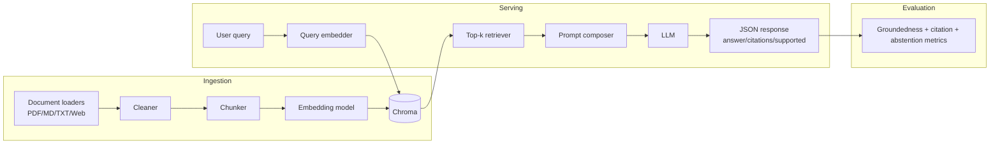

# Architecture Diagram

## Metadata contract

### Document-level
- `doc_id`
- `source`
- `title`
- `page_number` (nullable)
- `section_heading` (nullable)
- `raw_text`
- `processed_text`

### Chunk-level
- `chunk_id`
- `parent_doc_id`
- `page`
- `heading`
- `start_char`
- `end_char`
- `source_ref` (URL/path)
